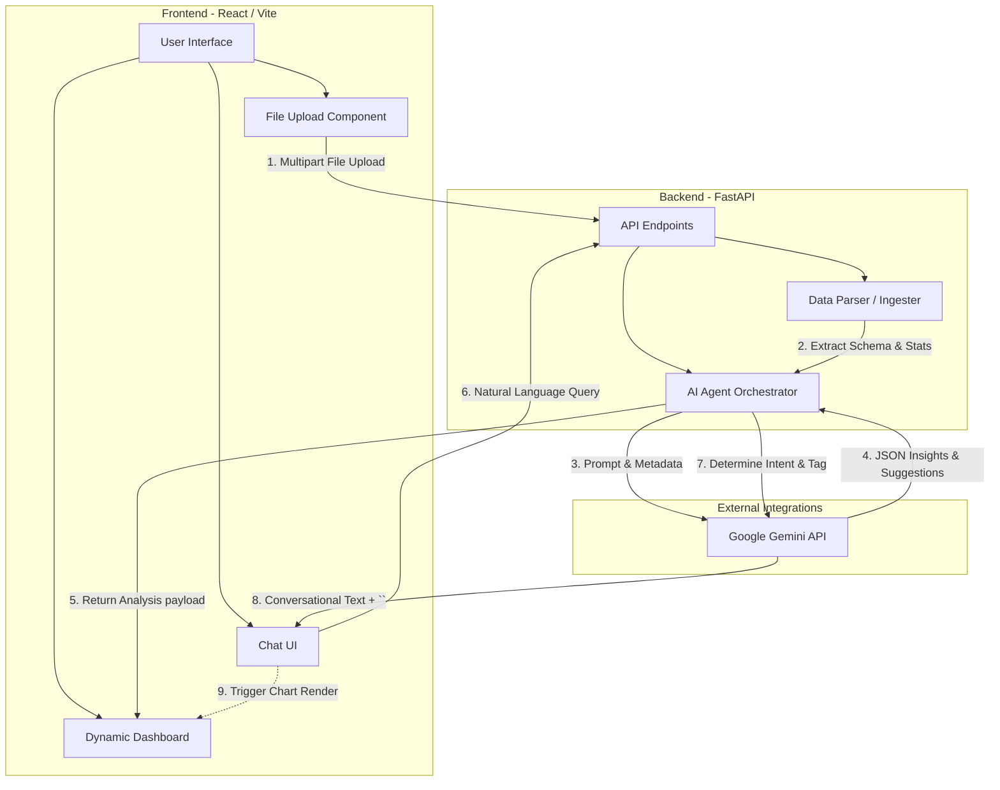

# DataSense Architecture and Design Document

This document provides an in-depth look at the architecture, workflow, and design patterns used in building the DataSense application.

## 1. High-Level Architecture

DataSense follows a modern, decoupled client-server architecture:
- **Frontend (Client)**: A React-based Single Page Application (SPA) built with Vite, TypeScript, Tailwind CSS, and Recharts.
- **Backend (Server)**: A Python FastAPI application responsible for parsing data, handling file uploads, and orchestrating AI interactions.
- **AI Layer (LLM API)**: Google's Gemini API serves as the core reasoning engine, invoked securely from the backend to analyze data schema and user queries.

### 1.1 Architecture Diagram



---

## 2. Core Workflows

The system has two primary workflows: **Initial Data Analysis** and **Conversational Interactivity**.

### 2.1 Initial Data Analysis Workflow
When a user uploads a file, the system must parse the data without overwhelming the AI with millions of rows of data or unstructured noise.

1. **Ingestion (`api/upload`)**: The React frontend sends the file as a `multipart/form-data` request.
2. **Parsing & Introspection (`data_parser.py`)**: 
   - Tabular files (CSV, XLSX, JSON) are loaded into a Pandas DataFrame.
   - The parser extracts maximum 300 rows as a representative sample.
   - **Crucial Step**: It calculates metadata for every column (data type, missing values, min/max for numbers, unique categories for strings).
3. **Multi-Agent Pipeline (`ai_agent.py`)**:
   - **Analyzer Agent**: Takes the column metadata and generates an executive summary and suggests 3-4 charts.
   - **Configuration Agent**: Takes those suggestions and maps the literal column names to axes (`x_key`, `y_keys`, `value_key`) suitable for Recharts.
4. **Rendering (`Dashboard.tsx`)**: The frontend loops over `chart_configs` and mounts customized Recharts elements dynamically.

### 2.2 Conversational Workflow (Chat-to-Viz)
Users can request specific visualizations or ask questions about the data using natural language.

1. **Query Submission**: The user types "Show me a pie chart" in the `Chat.tsx` interface.
2. **Contextual Prompting**: The backend constructs a prompt containing the user's query, chat history, and the structural summary of the active document.
3. **Structured Emission**: The Gemini API acts under a strict negative constraint prompt to *never output code*. If the user asks for a chart, the model emits an invisible HTML-like routing tag: `<CHART: Pie Chart>`.
4. **UI Interception**: The frontend regex engine scans the incoming text for `<CHART: ...>`. When found, it automatically:
   - Updates the dashboard state by pushing a new timestamped `ChartRequest` object.
   - Triggers `autoConfigForType()`, an algorithmic method that looks at the raw data and picks the best columns for a Pie Chart automatically.
   - Scrolls the user up to see the newly minted visualization tab.

---

## 3. Design Principles and Patterns

### 3.1 LLM Data Privacy & Efficiency Concept
**"Send the schema, not the data"**: LLMs have context limits and bill by tokens. DataSense never sends entire massive CSVs to the LLM. Instead, it computes statistical summaries (column names, types, value ranges) locally in Python using Pandas, and only sends that condensed metadata pattern to Gemini for reasoning.

### 3.2 Dynamic Component Rendering strategy
The frontend avoids hardcoded visualizations by using an abstraction: `ChartConfig`.
```typescript
type ChartConfig = {
  type: string;
  x_key?: string;
  y_keys?: string[];
  // ...
}
```
Recharts wrappers dynamically inspect `config.type` to decide whether to mount a `<BarChart>`, `<PieChart>`, or `<ScatterChart>`, passing it the appropriate variables. This creates a highly extensible system where adding a new chart type only requires adding a case to the switch statement.

### 3.3 State Management Decoupling
To enable Chat-to-Dashboard communication without complex global state (like Redux), DataSense hoists the `chartRequest` state to the root `App.tsx`:
- `Chat.tsx` triggers `handleChartRequested(type)` and passes it up.
- `App.tsx` updates `chartRequest: { type: string, ts: number }`.
- `Dashboard.tsx` accepts `chartRequest` as a prop and uses `useEffect` to intercept the timestamp change and generate the new chart configuration algorithmically.

### 3.4 Modern Light Theme Aesthetic
The UI was explicitly engineered using Tailwind CSS to diverge from standard enterprise boilerplate:
- **Glassmorphism**: Utilizing `backdrop-blur-md` and semi-transparent white backgrounds (`bg-white/80`) to create depth against a gradient backdrop.
- **Warm Color Palette**: Moving away from sterile blues/purples toward an engaging warm palette (Orange 500, Yellow 500 gradients).
- **Graceful Error States**: SVG-based fallback screens (like the Knowledge Graph processor handling empty relational data gracefully without crashing ReactFlow) ensures robustness.
