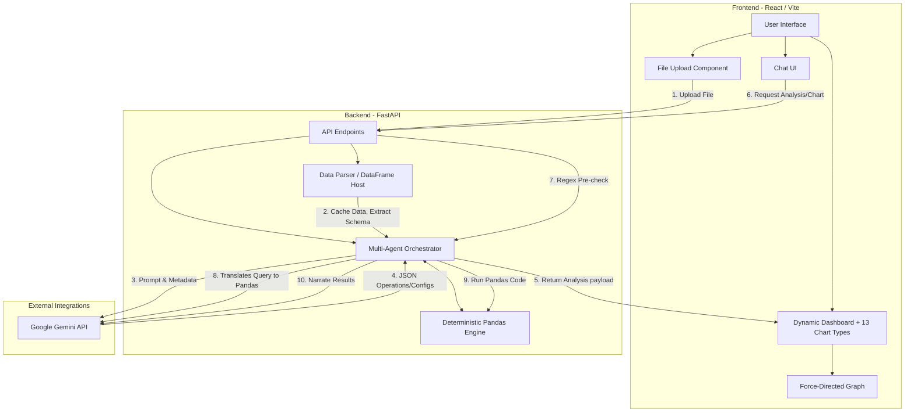

# DataSense Architecture and Design Document

This document provides an in-depth look at the architecture, workflow, and design patterns used in building the DataSense application, specifically focusing on the Hybrid Deterministic-Probabilistic pipeline.

## 1. High-Level Architecture

DataSense follows a modern, decoupled client-server architecture:
- **Frontend (Client)**: A React-based Single Page Application (SPA) built with Vite, TypeScript, Tailwind CSS v4, Plotly.js, and `react-force-graph-2d`.
- **Backend (Server)**: A Python FastAPI application responsible for parsing data, handling file uploads, deterministic DataFrame execution, and orchestrating AI interactions.
- **AI Layer (LLM API)**: Google's Gemini API serves as the core reasoning engine, invoked securely from the backend to analyze data schema and user queries.

### 1.1 Architecture Diagram

---

## 2. Core Workflows

The system has two primary workflows: **Initial Data Analysis** and **Hybrid Conversational Interactivity**.

### 2.1 Initial Data Analysis Workflow
When a user uploads a file, the system must parse the data without overwhelming the AI with millions of rows.

1. **Ingestion (`api/upload`)**: The React frontend sends the file.
2. **Parsing & Introspection (`data_parser.py`)**: 
   - Tabular files are loaded into a Pandas DataFrame and **cached globally** on the backend.
   - The parser extracts metadata for every column (data type, missing values, min/max, unique categories).
3. **Multi-Agent Pipeline (`ai_agent.py`)**:
   - **Analyzer Agent**: Generates an executive summary based purely on schema.
   - **Configuration Agent**: Suggests layout structures and maps columns to Recharts/Plotly properties (`x_key`, `y_keys`, `path_cols`).
4. **Rendering (`Dashboard.tsx`)**: The frontend receives JSON configurations and deterministic KPIs, rendering Plotly elements dynamically.

### 2.2 Hybrid Conversational Workflow (Chat-to-Data)
DataSense prevents AI hallucinations by executing queries deterministically in Python rather than relying on the LLM to guess answers or write unverified code.

1. **Query Submission**: User asks "what is the average salary by department?"
2. **Deterministic Pre-Check (`main.py`)**: A regex engine checks if this is a visualization request. If so, it routes to the `Chat-to-Viz` pipeline to emit a `<CHART: ...>` tag.
3. **AI Query Translation (Agent 3B)**: If not a visualization, the LLM translates the English query into a strict JSON pandas operation: `{"operation": "group_agg", "params": {"group_by": "department", "agg_col": "salary", "agg_func": "mean"}}`.
4. **Deterministic Execution (`_execute_pandas_query`)**: The Python backend flawlessly executes the generated JSON instructions against the *full* cached dataset.
5. **AI Narration**: The exact pandas numeric result is sent *back* to the LLM to format into human-readable markdown.

---

## 3. Advanced Features

### 3.1 Unification of 13 Plotly Structures
DataSense abstracts away charting logic by defining a universal `ChartConfig`. The AI determines the specific `chart_type` (out of 13 supported types including Treemap, Sunburst, Violin, Funnel, Waterfall, etc.) and maps columns accordingly. The frontend reacts to chat instructions containing `<CHART: Type>` by seamlessly switching the view and injecting the new component.

### 3.2 Physics-Based Knowledge Graphs (D3)
For unstructured data or relational sets, DataSense drops Plotly in favor of `react-force-graph-2d`.
- Nodes represent entities; links represent dynamically extracted relationships.
- A D3.js physics engine uses `charge`, `collide`, and `center` mechanics.
- Node size is determined by connection degree (`Math.sqrt(degree)`), ensuring highly connected hubs become visual centers of gravity.

### 3.3 LLM Data Privacy Concept
**"Send the schema, Execute the data"**: Raw row-level data is never sent to the LLM API. Only highly compressed, statistical summaries (column names, types, lengths) are transmitted. This enforces 100% data privacy and drastically mitigates token costs while maintaining insight accuracy.
