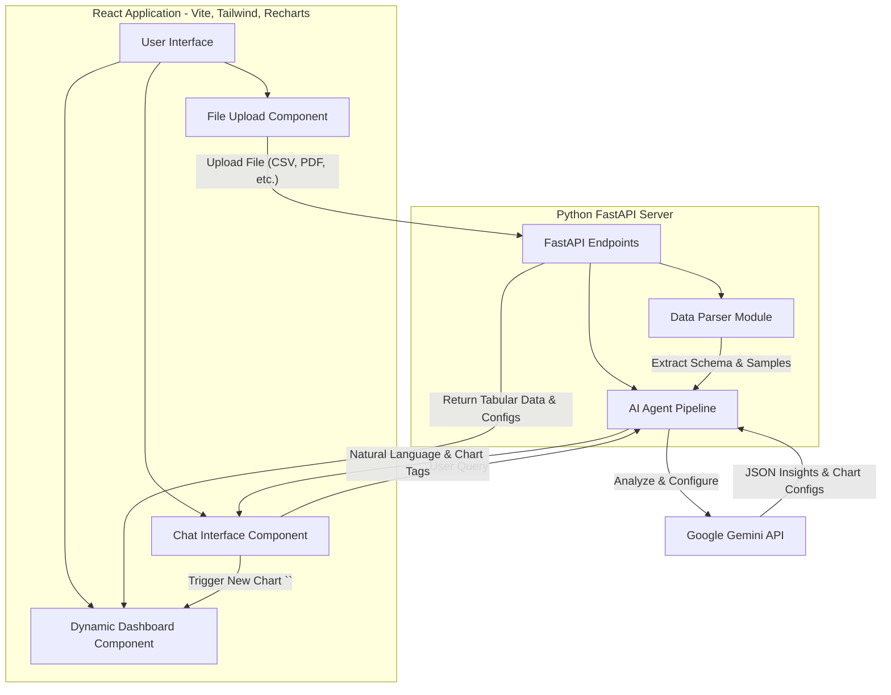

# DataSense: AI-Powered Dynamic Data Visualization Pipeline

DataSense is an intelligent, multi-agent web application that transforms raw data files (CSV, JSON, XLSX, PDF) into interactive business dashboards and insights in minutes. It leverages the Gemini API to analyze uploaded data, intelligently suggest visualizations, and configure complex chart mappings automatically. Users can also interact with their data using natural language through an integrated chat interface.

## Table of Contents

- [Features](#features)
- [Architecture & Data Flow](#architecture--data-flow)
- [Tech Stack](#tech-stack)
- [Getting Started](#getting-started)
- [How the AI Agents Work](#how-the-ai-agents-work)

## Features

- **Intelligent File Parsing**: Supports various formats including structured tabular data (CSV, XLSX, JSON) and unstructured text (PDF).
- **Automated Dashboard Generation**: AI analyzes the data schema and automatically generates relevant charts (Bar, Line, Pie, Scatter, etc.) with correct column mappings.
- **Natural Language Interaction**: Chat with your data to ask questions or request specific visualization types.
- **Dynamic UI**: Charts and components update in real-time as you interact with the AI assistant.
- **Knowledge Graph Extraction**: For unstructured or relational data, AI builds a visual Knowledge Graph representing key entities and their relationships.
- **Modern UI**: Clean, responsive, light-themed glassmorphism interface built with Tailwind CSS.

## Architecture & Data Flow

DataSense uses a separated frontend/backend architecture with a dedicated AI processing layer.



### Flow Breakdown:

1. **Upload Phase**: The user uploads a file via the React frontend.
2. **Parsing Phase**: The FastAPI backend parses the file. If tabular, it extracts maximum 300 rows and generates detailed column metadata (types, distinct values, min/max). If PDF, it extracts text.
3. **AI Pipeline Stage 1**: The data schema is sent to Gemini to generate an executive summary and suggest 3-4 optimal chart types.
4. **AI Pipeline Stage 2**: Using the suggested chart types, Gemini maps exact column names to required chart axes (e.g., `x_key`, `y_keys`, `label_key`).
5. **Dashboard Render**: The frontend receives the payload and renders fully configured interactive Recharts.
6. **Chat Interaction**: When a user requests a new chart in the chat (e.g., "show me a pie chart"), Gemini outputs a hidden `<CHART: Pie Chart>` tag. The frontend intercepts this tag, dynamically configures the required columns via `autoConfigForType()`, and injects the new chart into the dashboard view.

## Tech Stack

### Frontend

- **React 18** (Vite)
- **TypeScript**
- **Tailwind CSS v4** (Light theme + Glassmorphism)
- **Recharts** (Data Visualization)
- **Framer Motion** (UI Animations)
- **Lucide React** (Icons)

### Backend

- **Python 3.11**
- **FastAPI** (Web framework)
- **Google Generative AI (Gemini)** (LLM engine)
- **Pandas** (Data manipulation)
- **PyPDF2** (PDF extraction)

## Getting Started

### Prerequisites

- Node.js v20.19+
- Python 3.10+
- A Google Gemini API Key

### Backend Setup

1. Navigate to the `backend` directory.
2. Create and activate a virtual environment:
   ```bash
   python3 -m venv .venv
   mac: source venv/bin/activate
   Windows: .venv\Scripts\activate
   ```
3. Install dependencies:
   ```bash
   pip install -r requirements.txt
   ```
4. Create a `.env` file and add your API key:
   ```env
   GEMINI_API_KEY=your_api_key_here
   ```
5. Start the FastAPI server:
   ```bash
   uvicorn main:app --reload --port 8000
   ```

### Frontend Setup

1. Navigate to the `frontend` directory.
2. Install dependencies:
   ```bash
   npm install
   ```
3. Start the Vite development server:
   ```bash
   npm run dev
   ```
4. Open `http://localhost:5173` in your browser.

## How the AI Agents Work

DataSense relies on precision prompt engineering rather than raw language generation.

1. **The Analyzer Agent**: Responsible for ingesting the data schema. It strictly outputs JSON containing `content_summary` and `insights`. It is instructed to act as a Data Scientist, prioritizing actionable business intelligence.
2. **The Configuration Agent**: Takes the list of suggested chart types and the data schema, and acts as a "Frontend Developer". It maps specific keys like `x_key`, `y_keys`, and `value_key` so the Recharts library knows exactly what data to plot.
3. **The Chat Agent**: Handles the conversation history. It is programmed with a strict negative constraint: _Never output code blocks_. Instead, if a user requests a new layout or metric visualization, it outputs an HTML-like tag (e.g., `<CHART: Scatter Plot>`) alongside conversational text. The React frontend parses this tag to update application state, bridging the gap between natural language and UI rendering seamlessly.
